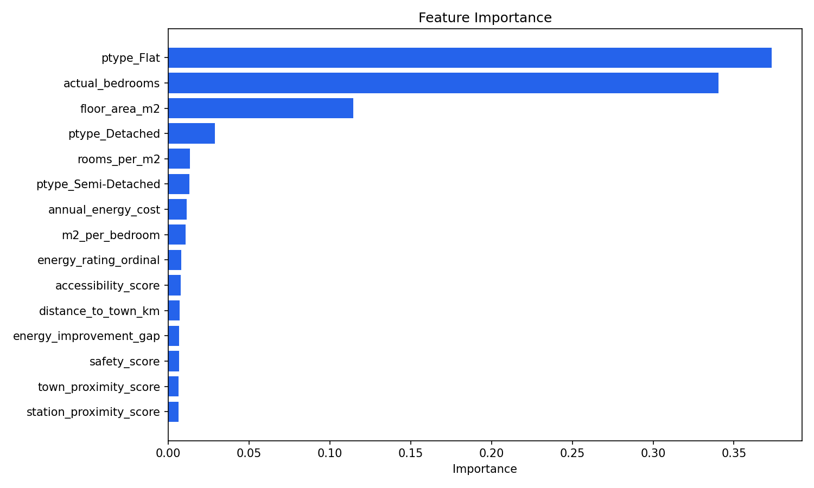
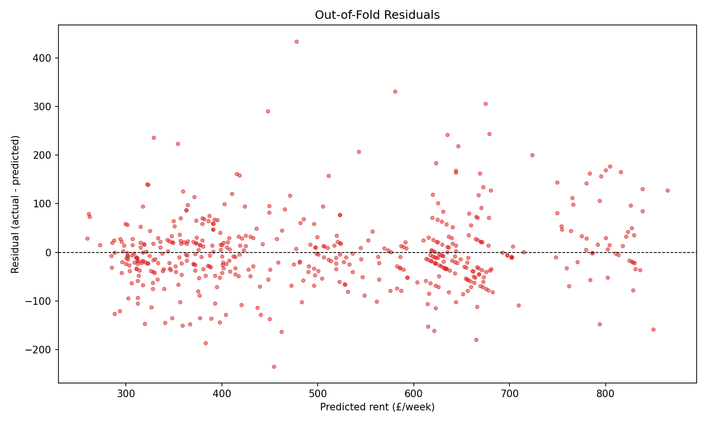
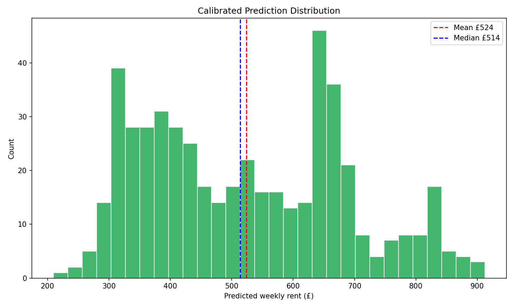

# Model Evaluation Report

**Model:** rent_model v4.3.0
**Generated:** 2026-03-10 20:26

---

## 1. Standard Metrics

| Metric | Value |
|--------|-------|
| MAE | £48.48/week |
| RMSE | £73.95/week |
| R² | 0.7854 |
| MAPE | 15.4% |

---

## 1b. Scraped-Only Metrics (Ground Truth)

> Primary production quality metric — evaluated on actual Zoopla/Rightmove rents only

| Metric | Value |
|--------|-------|
| MAE (scraped) | £88.82/week |
| RMSE (scraped) | £118.29/week |
| R² (scraped) | 0.6635 |

---

## 2. Cross-Validation (5-fold)

| Metric | Mean ± Std |
|--------|-----------|
| MAE | 0.17 ± 0.01 |
| RMSE | 0.24 ± 0.02 |
| R² | 0.71 ± 0.04 |

---

## 3. Feature Importance

| Rank | Feature | Importance |
|------|---------|-----------|
| 1 | ptype_Detached | 0.3433 |
| 2 | ptype_Flat | 0.1046 |
| 3 | floor_area_m2 | 0.1017 |
| 4 | sector_median_rent | 0.0684 |
| 5 | has_mains_gas | 0.0606 |
| 6 | actual_bedrooms | 0.0326 |
| 7 | price_drop_pct | 0.0294 |
| 8 | safety_score | 0.0288 |
| 9 | ptype_Unknown | 0.0288 |
| 10 | sale_count | 0.0245 |
| 11 | age_band_ordinal | 0.0229 |
| 12 | ptype_Terraced | 0.0208 |
| 13 | distance_to_station_km | 0.0184 |
| 14 | distance_to_uni_km | 0.0179 |
| 15 | location_score | 0.0177 |
| 16 | ptype_Semi-Detached | 0.0167 |
| 17 | distance_to_town_km | 0.0150 |
| 18 | rooms_per_m2 | 0.0105 |
| 19 | potential_rating_ordinal | 0.0097 |
| 20 | energy_improvement_gap | 0.0075 |
| 21 | energy_rating_ordinal | 0.0073 |
| 22 | floor_level_ordinal | 0.0068 |
| 23 | annual_energy_cost | 0.0062 |

---

## 4. Residual Analysis

---

## 5. Sanity Checks

| Check | Prediction | Expected | Result |
|-------|-----------|----------|--------|
| 34.5m² studio flat (1 hab room) | 187.15 | £150–350/week (£650–1,520/mo) | ✅ PASS |
| 120m² detached house (5 hab rooms) | 321.7 | £350–700/week | ❌ FAIL |
| Type ordering (80m², 3-bed) | Flat=204, Semi=251, Det=296 | Distinct predictions per type | ✅ PASS |
| Monotonic floor_area | 30m²=£181, 60m²=£192, 90m²=£219, 120m²=£239 | Increasing rent with area | ✅ PASS |

---

## 6. Prediction Distribution

| Stat | Value |
|------|-------|
| Mean | £5.76/week |
| Median | £5.74/week |
| Std | £0.36 |
| Min | £4.43/week |
| Max | £6.78/week |
| Outliers (>2σ) | 934 (5.2%) |

